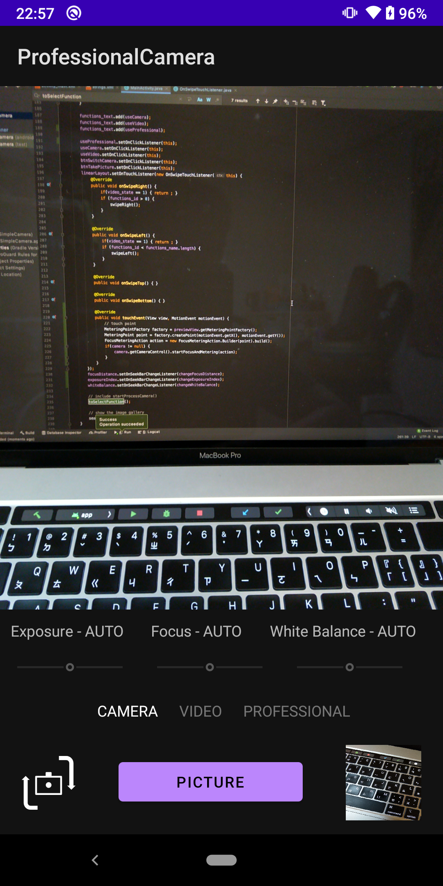
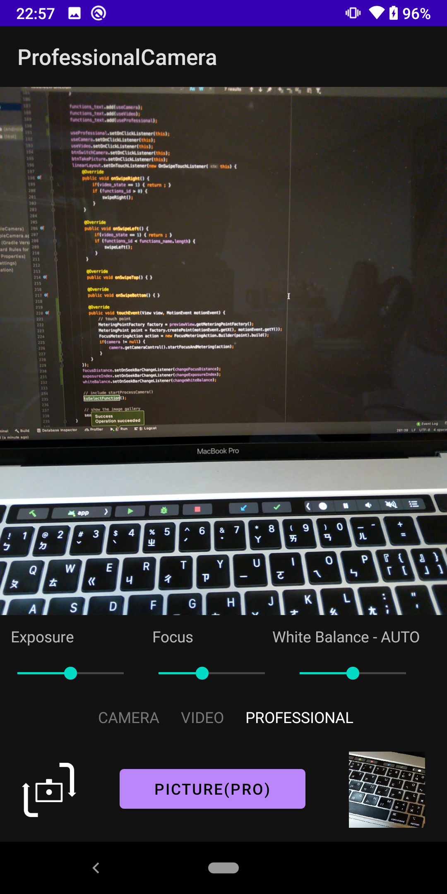

# Camera in Professional Mode

The repository shows how to build a camera app by using CameraX. The following features are supported.

- Image Capture
- Video Capture
- Image Analysis
- Switch the cameras between the front and the back len.
- Swipe to switch cameras.
- Save the image and the video to the local.
- Thumbnails of the image or the video.
- Tap the screen to do auto-exposure, auto-focus, and auto white-balance.

Within the professional mode, we provide with approaches of adjusting 3A parameters,

- Exposure Adjustment
- Focus Adjustment
- White Balance Adjustment

The screenshots:

| Regular Camera | Professional Camera |
|--|--|
|  |  |
